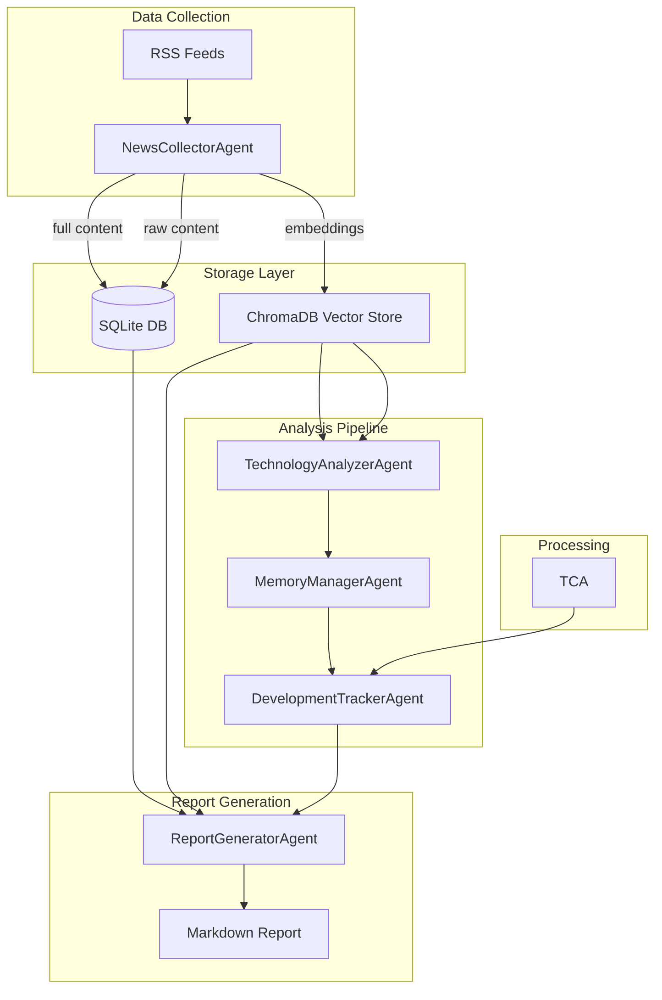

# News Collector SQLite Storage & Report Generator Agent Implementation Plan

## Overview

This plan outlines the implementation of two key enhancements to the multi-agent system:

1. **Enhanced NewsCollectorAgent** - Store news content in SQLite for human-readable reference while maintaining ChromaDB for vector search
2. **ReportGeneratorAgent** - Generate comprehensive markdown reports with technology trends, company/country analysis, and LLM-powered significance assessment

## Architecture Diagram



## Component Details

### 1. SQLite Database Schema

#### News Articles Table
```sql
CREATE TABLE news_articles (
    id TEXT PRIMARY KEY,
    title TEXT NOT NULL,
    url TEXT UNIQUE NOT NULL,
    source TEXT NOT NULL,
    author TEXT,
    published_date DATETIME,
    collected_date DATETIME DEFAULT CURRENT_TIMESTAMP,
    summary TEXT,
    content TEXT,
    sentiment_score REAL,
    relevance_score REAL,
    category TEXT,
    keywords TEXT,  -- JSON array of matched keywords
    processed BOOLEAN DEFAULT FALSE
);

CREATE INDEX idx_news_published ON news_articles(published_date);
CREATE INDEX idx_news_source ON news_articles(source);
CREATE INDEX idx_news_category ON news_articles(category);
```

#### Companies Table
```sql
CREATE TABLE companies (
    id TEXT PRIMARY KEY,
    name TEXT NOT NULL,
    country TEXT,
    industry TEXT,
    first_mentioned DATETIME,
    last_mentioned DATETIME,
    mention_count INTEGER DEFAULT 1
);

CREATE INDEX idx_companies_country ON companies(country);
```

#### Countries Table
```sql
CREATE TABLE countries (
    id TEXT PRIMARY KEY,
    name TEXT NOT NULL,
    code TEXT,  -- ISO country code
    mention_count INTEGER DEFAULT 1,
    last_mentioned DATETIME
);
```

#### Article-Company-Country Junction Table
```sql
CREATE TABLE article_entities (
    article_id TEXT,
    company_id TEXT,
    country_id TEXT,
    context TEXT,  -- Context in which entity was mentioned
    PRIMARY KEY (article_id, company_id, country_id),
    FOREIGN KEY (article_id) REFERENCES news_articles(id),
    FOREIGN KEY (company_id) REFERENCES companies(id),
    FOREIGN KEY (country_id) REFERENCES countries(id)
);
```

#### Reports Table
```sql
CREATE TABLE reports (
    id TEXT PRIMARY KEY,
    generated_date DATETIME DEFAULT CURRENT_TIMESTAMP,
    report_type TEXT,
    period_start DATETIME,
    period_end DATETIME,
    file_path TEXT,
    summary TEXT
);

CREATE INDEX idx_reports_date ON reports(generated_date);
```

### 2. New Data Models - schemas.py

```python
class NewsArticle(BaseModel):
    id: str
    title: str
    url: str
    source: str
    author: Optional[str] = None
    published_date: datetime
    collected_date: datetime = Field(default_factory=datetime.now)
    summary: str
    content: Optional[str] = None
    sentiment_score: float = 0.0
    relevance_score: float = 0.0
    category: str = "General"
    keywords: list[str] = Field(default_factory=list)
    processed: bool = False

class Company(BaseModel):
    id: str
    name: str
    country: Optional[str] = None
    industry: Optional[str] = None
    first_mentioned: datetime
    last_mentioned: datetime
    mention_count: int = 1

class CountryMention(BaseModel):
    id: str
    name: str
    code: Optional[str] = None
    mention_count: int = 1
    last_mentioned: datetime

class EntityExtraction(BaseModel):
    companies: list[Company] = Field(default_factory=list)
    countries: list[CountryMention] = Field(default_factory=list)
    context: dict[str, str] = Field(default_factory=dict)

class ReportSection(BaseModel):
    title: str
    content: str
    priority: int = 0

class GeneratedReport(BaseModel):
    id: str
    generated_date: datetime
    period_start: datetime
    period_end: datetime
    title: str
    executive_summary: str
    sections: list[ReportSection]
    notable_technologies: list[dict]
    key_companies: list[dict]
    key_countries: list[dict]
    significance_analysis: dict
    file_path: Optional[str] = None
```

### 3. SQLite Storage Module - src/storage/sqlite_store.py

Key responsibilities:
- Database connection management
- CRUD operations for news articles
- Entity storage and retrieval
- Report metadata storage
- Query methods for report generation

```python
class SQLiteStore:
    def __init__(self, db_path: str = "./data/news_content.db"):
        # Initialize connection and create tables
        
    def store_article(self, article: NewsArticle) -> str:
        # Store article and return ID
        
    def store_company(self, company: Company) -> str:
        # Store or update company
        
    def store_country(self, country: CountryMention) -> str:
        # Store or update country
        
    def link_article_entities(self, article_id: str, entities: EntityExtraction):
        # Create junction records
        
    def get_articles_by_date_range(self, start: datetime, end: datetime) -> list[NewsArticle]:
        # Query articles by date
        
    def get_companies_by_article(self, article_id: str) -> list[Company]:
        # Get companies mentioned in article
        
    def get_top_companies(self, limit: int = 10) -> list[dict]:
        # Get most mentioned companies
        
    def get_top_countries(self, limit: int = 10) -> list[dict]:
        # Get most mentioned countries
```

### 4. Enhanced NewsCollectorAgent

Modifications to existing [`NewsCollectorAgent`](src/agents/news_collector.py:99):

```python
class NewsCollectorAgent(BaseAgent):
    def __init__(self, sqlite_store: SQLiteStore = None, **kwargs):
        super().__init__(name="NewsCollectorAgent", **kwargs)
        self.sqlite_store = sqlite_store or SQLiteStore()
        # ... existing initialization
        
    async def process(self, input_data: Optional[dict] = None) -> list[TechnologyMention]:
        # ... existing feed fetching logic
        
        # NEW: Store articles in SQLite
        for entry in entries:
            article = NewsArticle(
                id=str(uuid.uuid4()),
                title=entry["title"],
                url=entry["link"],
                source=entry["source"],
                published_date=entry["published"],
                summary=entry["summary"],
                sentiment_score=sentiment,
                relevance_score=relevance,
                keywords=matched_keywords,
            )
            self.sqlite_store.store_article(article)
            
            # NEW: Extract and store entities
            entities = self.extract_entities(entry)
            self.sqlite_store.link_article_entities(article.id, entities)
        
        # ... rest of existing logic
```

### 5. Entity Extraction Module - src/utils/entity_extractor.py

```python
class EntityExtractor:
    # Known tech companies with country mapping
    TECH_COMPANIES = {
        "OpenAI": "USA",
        "Google": "USA",
        "Microsoft": "USA",
        "Apple": "USA",
        "Meta": "USA",
        "Amazon": "USA",
        "NVIDIA": "USA",
        "Tesla": "USA",
        "Anthropic": "USA",
        "DeepMind": "UK",
        "Samsung": "South Korea",
        "Huawei": "China",
        "Alibaba": "China",
        "Tencent": "China",
        "Baidu": "China",
        "ByteDance": "China",
        "Sony": "Japan",
        "Toyota": "Japan",
        "SoftBank": "Japan",
        "ASML": "Netherlands",
        "Spotify": "Sweden",
        # ... more companies
    }
    
    def extract_companies(self, text: str) -> list[Company]:
        # Extract company mentions from text
        
    def extract_countries(self, text: str) -> list[CountryMention]:
        # Extract country mentions from text
        
    def extract_all(self, text: str) -> EntityExtraction:
        # Combined extraction
```

### 6. LLM Integration Module - src/utils/llm_analyzer.py

This module provides LLM-powered analysis capabilities using LangChain with OpenAI:

```python
from langchain_openai import ChatOpenAI
from langchain.prompts import ChatPromptTemplate
from langchain.output_parsers import PydanticOutputParser
from typing import Optional
import os

class LLMAnalyzer:
    def __init__(self, model_name: str = "gpt-4o-mini", api_key: Optional[str] = None):
        self.llm = ChatOpenAI(
            model=model_name,
            api_key=api_key or os.getenv("OPENAI_API_KEY"),
            temperature=0.7
        )
        
    async def generate_executive_summary(
        self,
        articles: list[dict],
        technologies: list[dict]
    ) -> str:
        """Generate an intelligent executive summary using LLM."""
        prompt = ChatPromptTemplate.from_messages([
            ("system", """You are a technology analyst. Generate a concise executive summary
            of the technology news landscape based on the provided articles and technologies.
            Focus on key trends, significant developments, and market implications."""),
            ("user", """Articles: {articles}
            Technologies: {technologies}
            
            Generate a 2-3 paragraph executive summary:""")
        ])
        chain = prompt | self.llm
        response = await chain.ainvoke({
            "articles": self._format_articles_for_prompt(articles[:20]),
            "technologies": self._format_technologies_for_prompt(technologies)
        })
        return response.content
        
    async def analyze_significance(
        self,
        article: dict,
        related_technologies: list[dict]
    ) -> dict:
        """Analyze the significance of a news article using LLM."""
        prompt = ChatPromptTemplate.from_messages([
            ("system", """You are a technology news analyst. Analyze the significance
            of the given news article. Consider:
            1. Market impact potential
            2. Technology advancement implications
            3. Competitive landscape effects
            4. Geographic relevance
            
            Return a JSON object with keys: significance_score, market_impact,
            technology_implications, competitive_effects, geographic_relevance"""),
            ("user", """Article Title: {title}
            Article Summary: {summary}
            Related Technologies: {technologies}
            
            Analyze the significance:""")
        ])
        chain = prompt | self.llm
        response = await chain.ainvoke({
            "title": article.get("title", ""),
            "summary": article.get("summary", "")[:1000],
            "technologies": [t.get("name", "") for t in related_technologies]
        })
        return self._parse_significance_response(response.content)
        
    async def extract_entities_with_context(
        self,
        text: str
    ) -> dict:
        """Extract companies and countries with context using LLM."""
        prompt = ChatPromptTemplate.from_messages([
            ("system", """Extract companies and countries mentioned in the text.
            For each entity, provide the context in which it was mentioned.
            Return a JSON object with keys: companies, countries
            Each should be a list of objects with: name, context, sentiment"""),
            ("user", """Text: {text}
            
            Extract entities:""")
        ])
        chain = prompt | self.llm
        response = await chain.ainvoke({"text": text[:2000]})
        return self._parse_entity_response(response.content)
        
    async def generate_trend_analysis(
        self,
        technologies: list[dict],
        articles: list[dict]
    ) -> str:
        """Generate trend analysis using LLM."""
        prompt = ChatPromptTemplate.from_messages([
            ("system", """You are a technology trend analyst. Analyze the provided
            technologies and news articles to identify:
            1. Emerging trends
            2. Declining technologies
            3. Cross-technology synergies
            4. Market opportunities"""),
            ("user", """Technologies: {technologies}
            Recent Articles: {articles}
            
            Generate a trend analysis:""")
        ])
        chain = prompt | self.llm
        response = await chain.ainvoke({
            "technologies": self._format_technologies_for_prompt(technologies),
            "articles": self._format_articles_for_prompt(articles[:15])
        })
        return response.content
        
    async def generate_company_analysis(
        self,
        company_name: str,
        articles: list[dict]
    ) -> dict:
        """Generate detailed company analysis using LLM."""
        prompt = ChatPromptTemplate.from_messages([
            ("system", """You are a business intelligence analyst. Analyze the news
            coverage of a company and provide insights on:
            1. Recent activities and announcements
            2. Strategic direction
            3. Market position
            4. Technology focus areas"""),
            ("user", """Company: {company}
            Related Articles: {articles}
            
            Generate a company analysis:""")
        ])
        chain = prompt | self.llm
        response = await chain.ainvoke({
            "company": company_name,
            "articles": self._format_articles_for_prompt(articles)
        })
        return {
            "company": company_name,
            "analysis": response.content,
            "article_count": len(articles)
        }
```

### 7. ReportGeneratorAgent - src/agents/report_generator.py

Enhanced with LLM-powered analysis:

```python
from pathlib import Path
from datetime import datetime, timedelta
import uuid
from typing import Any, Optional

from ..models.schemas import GeneratedReport, ReportSection
from ..storage.sqlite_store import SQLiteStore
from ..utils.llm_analyzer import LLMAnalyzer
from ..utils.entity_extractor import EntityExtractor
from .base import BaseAgent

class ReportGeneratorAgent(BaseAgent):
    def __init__(
        self,
        sqlite_store: SQLiteStore = None,
        llm_analyzer: LLMAnalyzer = None,
        **kwargs
    ):
        super().__init__(name="ReportGeneratorAgent", **kwargs)
        self.sqlite_store = sqlite_store or SQLiteStore()
        self.llm_analyzer = llm_analyzer or LLMAnalyzer()
        self.entity_extractor = EntityExtractor()
        self.report_dir = Path("./reports")
        self.report_dir.mkdir(exist_ok=True)
        
    async def process(self, input_data: dict) -> GeneratedReport:
        # Gather data from various sources
        period_start = input_data.get("period_start", datetime.now() - timedelta(days=7))
        period_end = input_data.get("period_end", datetime.now())
        
        articles = self.sqlite_store.get_articles_by_date_range(period_start, period_end)
        technologies = input_data.get("technologies", [])
        developments = input_data.get("developments", [])
        
        # LLM-powered executive summary
        executive_summary = await self.llm_analyzer.generate_executive_summary(
            articles, technologies
        )
        
        # Generate report sections with LLM analysis
        sections = await self._generate_sections_with_llm(articles, technologies, developments)
        
        # LLM-powered significance analysis
        significance_analysis = await self._analyze_significance_with_llm(articles, technologies)
        
        # Extract and analyze companies/countries
        key_companies = await self._analyze_key_companies(articles)
        key_countries = await self._analyze_key_countries(articles)
        
        report = GeneratedReport(
            id=str(uuid.uuid4()),
            generated_date=datetime.now(),
            period_start=period_start,
            period_end=period_end,
            title=self._generate_title(articles, technologies),
            executive_summary=executive_summary,
            sections=sections,
            notable_technologies=self._get_notable_technologies(technologies),
            key_companies=key_companies,
            key_countries=key_countries,
            significance_analysis=significance_analysis,
        )
        
        # Save to file
        file_path = self._save_report(report)
        report.file_path = str(file_path)
        
        # Store report metadata in SQLite
        self.sqlite_store.store_report_metadata(report)
        
        return report
        
    async def _generate_sections_with_llm(
        self,
        articles: list[dict],
        technologies: list[dict],
        developments: list[dict]
    ) -> list[ReportSection]:
        """Generate detailed report sections using LLM."""
        sections = []
        
        # Technology Trends Section
        trend_analysis = await self.llm_analyzer.generate_trend_analysis(
            technologies, articles
        )
        sections.append(ReportSection(
            title="Technology Trends",
            content=trend_analysis,
            priority=1
        ))
        
        # Key Developments Section
        developments_content = await self._format_developments_with_llm(developments)
        sections.append(ReportSection(
            title="Key Developments",
            content=developments_content,
            priority=2
        ))
        
        # Market Insights Section
        market_insights = await self._generate_market_insights(articles, technologies)
        sections.append(ReportSection(
            title="Market Insights",
            content=market_insights,
            priority=3
        ))
        
        return sorted(sections, key=lambda x: x.priority)
        
    async def _analyze_significance_with_llm(
        self,
        articles: list[dict],
        technologies: list[dict]
    ) -> dict:
        """Perform LLM-powered significance analysis."""
        # Analyze top articles for significance
        top_articles = sorted(articles, key=lambda x: x.get("relevance_score", 0))[:10]
        
        significance_results = []
        for article in top_articles:
            related_techs = [t for t in technologies if self._is_related(article, t)]
            analysis = await self.llm_analyzer.analyze_significance(article, related_techs)
            significance_results.append({
                "article_title": article.get("title"),
                "analysis": analysis
            })
        
        # Aggregate significance metrics
        return {
            "high_significance_count": sum(
                1 for r in significance_results
                if r["analysis"].get("significance_score", 0) > 0.7
            ),
            "average_significance": sum(
                r["analysis"].get("significance_score", 0)
                for r in significance_results
            ) / max(len(significance_results), 1),
            "detailed_analysis": significance_results[:5],
            "market_impact_summary": await self._summarize_market_impact(significance_results)
        }
        
    async def _analyze_key_companies(self, articles: list[dict]) -> list[dict]:
        """Extract and analyze key companies using LLM."""
        company_mentions = {}
        
        for article in articles:
            entities = await self.llm_analyzer.extract_entities_with_context(
                f"{article.get('title', '')} {article.get('summary', '')}"
            )
            
            for company in entities.get("companies", []):
                name = company.get("name")
                if name not in company_mentions:
                    company_mentions[name] = {
                        "name": name,
                        "mention_count": 0,
                        "contexts": [],
                        "sentiments": []
                    }
                company_mentions[name]["mention_count"] += 1
                company_mentions[name]["contexts"].append(company.get("context", ""))
                company_mentions[name]["sentiments"].append(company.get("sentiment", 0))
        
        # Get top companies and generate analysis
        top_companies = sorted(
            company_mentions.values(),
            key=lambda x: x["mention_count"],
            reverse=True
        )[:10]
        
        for company in top_companies[:5]:
            company_articles = [
                a for a in articles
                if company["name"].lower() in f"{a.get('title', '')} {a.get('summary', '')}".lower()
            ]
            if company_articles:
                analysis = await self.llm_analyzer.generate_company_analysis(
                    company["name"], company_articles
                )
                company["analysis"] = analysis.get("analysis", "")
        
        return top_companies
        
    def _save_report(self, report: GeneratedReport) -> Path:
        """Save report as markdown file."""
        timestamp = report.generated_date.strftime("%Y%m%d_%H%M%S")
        filename = f"report_{timestamp}.md"
        filepath = self.report_dir / filename
        
        content = self._format_as_markdown(report)
        filepath.write_text(content)
        
        return filepath
        
    def _format_as_markdown(self, report: GeneratedReport) -> str:
        """Format report as markdown."""
        md = f"""# {report.title}

**Generated:** {report.generated_date.strftime('%Y-%m-%d %H:%M:%S')}
**Period:** {report.period_start.strftime('%Y-%m-%d')} to {report.period_end.strftime('%Y-%m-%d')}

## Executive Summary

{report.executive_summary}

"""
        
        # Add sections
        for section in report.sections:
            md += f"## {section.title}\n\n{section.content}\n\n"
        
        # Add notable technologies
        md += "## Notable Technologies\n\n"
        md += "| Technology | Category | Status | Trend | Confidence |\n"
        md += "|------------|----------|--------|-------|------------|\n"
        for tech in report.notable_technologies:
            md += f"| {tech.get('name', 'N/A')} | {tech.get('category', 'N/A')} | "
            md += f"{tech.get('status', 'N/A')} | {tech.get('trend_direction', 'N/A')} | "
            md += f"{tech.get('confidence_score', 0):.2f} |\n"
        
        # Add key companies
        md += "\n## Key Companies\n\n"
        for company in report.key_companies:
            md += f"### {company.get('name', 'Unknown')}\n"
            md += f"- **Mentions:** {company.get('mention_count', 0)}\n"
            if company.get("analysis"):
                md += f"\n{company['analysis']}\n"
            md += "\n"
        
        # Add key countries
        md += "## Countries in Focus\n\n"
        for country in report.key_countries:
            md += f"- **{country.get('name', 'Unknown')}:** {country.get('mention_count', 0)} mentions\n"
        
        # Add significance analysis
        md += f"\n## Significance Analysis\n\n"
        md += f"- **High Significance Articles:** {report.significance_analysis.get('high_significance_count', 0)}\n"
        md += f"- **Average Significance Score:** {report.significance_analysis.get('average_significance', 0):.2f}\n"
        
        if report.significance_analysis.get("market_impact_summary"):
            md += f"\n### Market Impact Summary\n\n{report.significance_analysis['market_impact_summary']}\n"
        
        return md
```

### 7. Report Template Structure

```markdown
# Technology News Analysis Report
**Generated:** {timestamp}
**Period:** {period_start} to {period_end}

## Executive Summary
{executive_summary}

## Notable Technologies
{technology_table}

## Key Companies
{companies_table}

## Countries in Focus
{countries_table}

## Key Developments
{developments_list}

## Significance Analysis
{significance_analysis}

### Market Impact
{market_impact}

### Technology Trends
{technology_trends}

### Geographic Insights
{geographic_insights}

## Appendix: Source Articles
{article_list}
```

### 8. Updated Pipeline Flow

```python
# In main.py
async def run_analysis(self, ...):
    # Step 1: Collect news (stores to SQLite + ChromaDB)
    news_mentions = await self.news_collector.process(...)
    
    # Step 2: Analyze technologies
    analysis_result = await self.tech_analyzer.process(...)
    
    # Step 3: Store in memory (ChromaDB)
    memory_result = await self.memory_manager.process(...)
    
    # Step 4: Track developments
    tracking_result = await self.dev_tracker.process(...)
    
    # Step 5: Generate report (NEW)
    report = await self.report_generator.process({
        "period_start": start_date,
        "period_end": end_date,
        "technologies": analysis_result["new_technologies"] + analysis_result["updated_technologies"],
        "developments": tracking_result,
    })
    
    return {
        # ... existing results
        "report": report,
    }
```

## File Structure After Implementation

```
src/
├── agents/
│   ├── __init__.py
│   ├── base.py
│   ├── news_collector.py      # Modified
│   ├── technology_analyzer.py
│   ├── memory_manager.py
│   ├── development_tracker.py
│   └── report_generator.py    # NEW
├── memory/
│   ├── __init__.py
│   └── vector_store.py
├── storage/
│   ├── __init__.py            # NEW
│   └── sqlite_store.py        # NEW
├── utils/
│   ├── __init__.py            # NEW
│   ├── entity_extractor.py    # NEW
│   └── llm_analyzer.py        # NEW
├── models/
│   └── schemas.py             # Modified
├── main.py                    # Modified
└── cli.py
data/
└── news_content.db            # SQLite database (NEW)
reports/
└── report_YYYYMMDD_HHMMSS.md  # Generated reports (NEW)
```

## Dependencies

The project already includes the required dependencies:
- `langchain>=0.3.0` - For LLM integration
- `langchain-openai>=0.2.0` - For OpenAI API integration
- SQLite is built into Python (no additional installation needed)

The LLM features require an OpenAI API key set in the environment variable `OPENAI_API_KEY`.

## Testing Strategy

1. **Unit Tests**
   - SQLite store CRUD operations
   - Entity extraction accuracy
   - Report generation formatting

2. **Integration Tests**
   - End-to-end pipeline with report generation
   - Data consistency between SQLite and ChromaDB

3. **Manual Testing**
   - Verify markdown report formatting
   - Check entity extraction accuracy

## Implementation Order

1. Create SQLite storage module
2. Update schemas with new models
3. Create entity extractor utility
4. Enhance NewsCollectorAgent
5. Create ReportGeneratorAgent
6. Update main.py integration
7. Add tests
