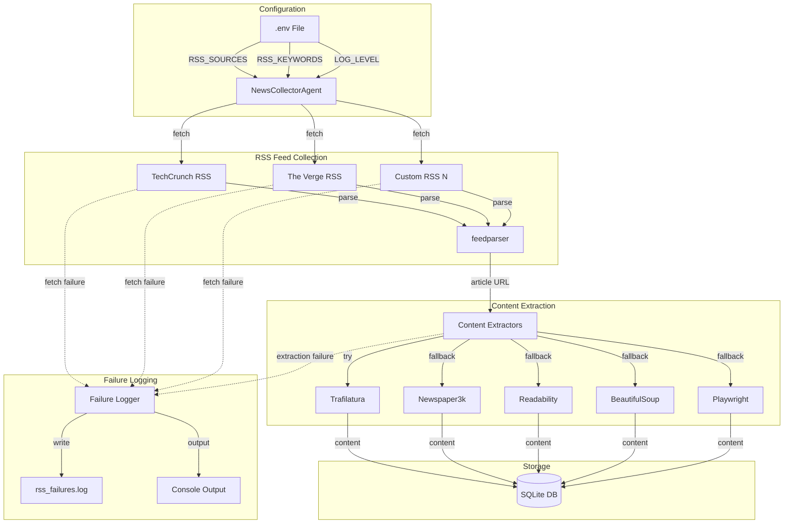
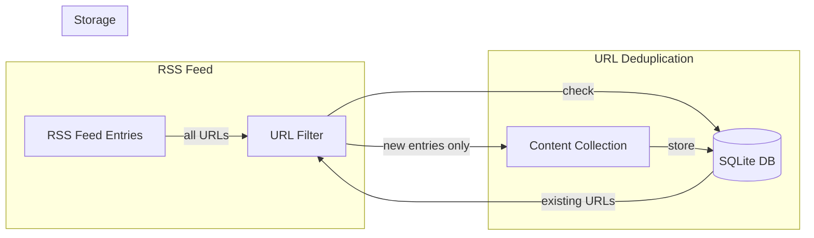
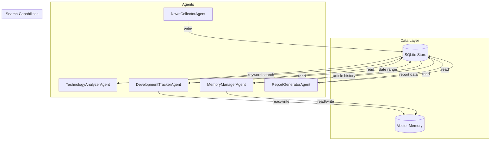

# NewsCollectorAgent RSS Feed Enhancement Plan

## Overview

This plan outlines the enhancement of the `NewsCollectorAgent` to support:
1. **Configurable RSS feed sources via `.env` file** - Allow users to customize RSS sources without code changes
2. **Complete article content storage** - Ensure full article content is stored for comprehensive analysis
3. **Comprehensive failure logging** - Log all failures to file for debugging and monitoring
4. **URL deduplication** - Track collected URLs to prevent duplicate collection
5. **Database search integration** - Update other agents to search the SQLite database for existing articles

## Current State Analysis

### Existing Implementation

The [`NewsCollectorAgent`](src/agents/news_collector.py:105) currently:

- **RSS Feed Support**: Already uses `feedparser` to parse RSS feeds
- **Hardcoded Sources**: Sources defined in [`TECH_NEWS_SOURCES`](src/agents/news_collector.py:19) constant
- **Content Extraction**: Has multiple extraction methods (Trafilatura, Newspaper3k, Readability, BeautifulSoup, Playwright)
- **Storage**: Stores articles in SQLite with `content` field
- **Limited Logging**: Only logs content extraction failures, not RSS fetch failures

### Key Files to Modify

| File | Purpose |
|------|---------|
| [`src/agents/news_collector.py`](src/agents/news_collector.py:1) | Main agent implementation |
| [`.env.example`](.env.example:1) | Environment variable template |

## Architecture Diagram



## Implementation Details

### 1. Environment Variable Configuration

#### New Environment Variables

```bash
# .env.example additions

# RSS Feed Sources (comma-separated URLs)
RSS_SOURCES=https://techcrunch.com/feed/,https://www.theverge.com/rss/index.xml,https://arstechnica.com/feed/

# Technology Keywords (comma-separated, optional - defaults to built-in list)
RSS_KEYWORDS=AI,machine learning,blockchain,quantum computing

# Content extraction settings
RSS_CONTENT_MAX_LENGTH=10000
RSS_CONTENT_TIMEOUT=30

# Logging settings
RSS_LOG_FAILURES=true
RSS_LOG_FILE=./logs/rss_failures.log
```

#### Configuration Loading

Create a new configuration module or extend the existing agent:

```python
# src/config/rss_config.py (new file)

import os
from typing import List
from dotenv import load_dotenv

load_dotenv()

class RSSConfig:
    """Configuration for RSS feed collection."""
    
    DEFAULT_SOURCES = [
        "https://techcrunch.com/feed/",
        "https://www.theverge.com/rss/index.xml",
        "https://arstechnica.com/feed/",
        "https://www.wired.com/feed/rss",
        "https://news.ycombinator.com/rss",
        "https://www.zdnet.com/news/rss/",
        "https://thenextweb.com/feed/",
    ]
    
    DEFAULT_KEYWORDS = [
        "AI", "artificial intelligence", "machine learning", 
        "deep learning", "neural network", "LLM", 
        # ... existing keywords
    ]
    
    @classmethod
    def get_sources(cls) -> List[str]:
        """Get RSS sources from environment or defaults."""
        sources = os.getenv("RSS_SOURCES", "")
        if sources:
            return [s.strip() for s in sources.split(",") if s.strip()]
        return cls.DEFAULT_SOURCES
    
    @classmethod
    def get_keywords(cls) -> List[str]:
        """Get keywords from environment or defaults."""
        keywords = os.getenv("RSS_KEYWORDS", "")
        if keywords:
            return [k.strip() for k in keywords.split(",") if k.strip()]
        return cls.DEFAULT_KEYWORDS
    
    @classmethod
    def get_max_content_length(cls) -> int:
        """Get maximum content length for stored articles."""
        return int(os.getenv("RSS_CONTENT_MAX_LENGTH", "10000"))
    
    @classmethod
    def get_timeout(cls) -> int:
        """Get HTTP timeout in seconds."""
        return int(os.getenv("RSS_CONTENT_TIMEOUT", "30"))
    
    @classmethod
    def is_failure_logging_enabled(cls) -> bool:
        """Check if failure logging is enabled."""
        return os.getenv("RSS_LOG_FAILURES", "true").lower() == "true"
    
    @classmethod
    def get_log_file(cls) -> str:
        """Get path to failure log file."""
        return os.getenv("RSS_LOG_FILE", "./logs/rss_failures.log")
```

### 2. Failure Logging System (File-Based)

The failure logging system uses Python's standard logging module to write all failures to a dedicated log file. This provides a simple, lightweight approach without database overhead.

#### Log File Format

Failures are logged to `./logs/rss_failures.log` with the following format:
```
2024-01-15 10:30:45,678 - WARNING - RSS_FETCH_FAILURE | source=https://example.com/feed | status=403 | error=HTTP 403 Forbidden
2024-01-15 10:31:02,123 - WARNING - CONTENT_EXTRACTION_FAILURE | url=https://article.com/1 | title=Article Title | source=TechCrunch
2024-01-15 10:32:00,456 - WARNING - RSS_PARSE_FAILURE | source=https://broken-feed.com/rss | error=XML parsing error
```

#### Failure Logger Class

```python
# src/utils/failure_logger.py (new file)

import logging
from datetime import datetime
from typing import Optional
from pathlib import Path

class FailureLogger:
    """File-based failure logging for RSS feed collection."""
    
    def __init__(self, log_file: str = "./logs/rss_failures.log"):
        self.log_file = Path(log_file)
        self.log_file.parent.mkdir(parents=True, exist_ok=True)
        
        # Setup file logger
        self.logger = logging.getLogger("rss_failures")
        self.logger.setLevel(logging.WARNING)
        
        # Remove existing handlers to avoid duplicates
        self.logger.handlers = []
        
        file_handler = logging.FileHandler(self.log_file)
        file_handler.setFormatter(logging.Formatter(
            '%(asctime)s - %(levelname)s - %(message)s'
        ))
        self.logger.addHandler(file_handler)
    
    def log_rss_fetch_failure(
        self,
        source_url: str,
        error: Exception,
        http_status: Optional[int] = None
    ):
        """Log RSS feed fetch failure."""
        self.logger.warning(
            f"RSS_FETCH_FAILURE | source={source_url} | "
            f"status={http_status or 'N/A'} | error={error}"
        )
        )
        
        return failure_id
    
    def log_content_extraction_failure(
        self,
        article_url: str,
        article_title: str,
        source: str,
        extraction_methods_tried: list = None
    ):
        """Log article content extraction failure."""
        methods = ", ".join(extraction_methods_tried) if extraction_methods_tried else "all methods"
        self.logger.warning(
            f"CONTENT_EXTRACTION_FAILURE | url={article_url} | "
            f"title={article_title[:50]}... | source={source} | methods_tried={methods}"
        )
    
    def log_parse_failure(
        self,
        source_url: str,
        error: Exception
    ):
        """Log RSS feed parsing failure."""
        self.logger.warning(
            f"RSS_PARSE_FAILURE | source={source_url} | error={error}"
        )
```

### 3. Enhanced NewsCollectorAgent

#### Modified Agent Implementation

Key changes to [`NewsCollectorAgent`](src/agents/news_collector.py:105):

```python
# Key modifications to news_collector.py

class NewsCollectorAgent(BaseAgent):
    def __init__(
        self, 
        sqlite_store: SQLiteStore = None,
        extract_entities: bool = True,
        sources: list[str] = None,  # Allow override
        keywords: list[str] = None,  # Allow override
        **kwargs
    ):
        super().__init__(name="NewsCollectorAgent", **kwargs)
        
        # Load configuration from environment
        from ..config.rss_config import RSSConfig
        
        self.sources = sources or RSSConfig.get_sources()
        self.keywords = keywords or RSSConfig.get_keywords()
        self.max_content_length = RSSConfig.get_max_content_length()
        
        self.session: Optional[aiohttp.ClientSession] = None
        self.sqlite_store = sqlite_store or SQLiteStore()
        self.extract_entities = extract_entities
        self.entity_extractor = EntityExtractor() if extract_entities else None
        
        # Initialize failure logger
        if RSSConfig.is_failure_logging_enabled():
            self.failure_logger = FailureLogger(
                log_file=RSSConfig.get_log_file()
            )
        else:
            self.failure_logger = None
    
    async def fetch_feed(self, url: str) -> list[dict]:
        """Fetch RSS feed with comprehensive error handling."""
        await self._ensure_session()
        entries = []

        try:
            async with self.session.get(url) as response:
                if response.status == 200:
                    feed_content = await response.text()
                    try:
                        feed = feedparser.parse(feed_content)
                        
                        # Check for parse errors
                        if feed.bozo and feed.bozo_exception:
                            if self.failure_logger:
                                self.failure_logger.log_parse_failure(
                                    source_url=url,
                                    error=feed.bozo_exception,
                                    raw_content_sample=feed_content[:500]
                                )
                            logger.warning(
                                f"RSS parse error for {url}: {feed.bozo_exception}"
                            )
                        
                        for entry in feed.entries[:20]:
                            # ... existing entry parsing logic
                            pass
                    except Exception as parse_error:
                        if self.failure_logger:
                            self.failure_logger.log_parse_failure(
                                source_url=url,
                                error=parse_error
                            )
                        logger.error(f"Failed to parse feed {url}: {parse_error}")
                else:
                    # Log HTTP failure
                    if self.failure_logger:
                        self.failure_logger.log_rss_fetch_failure(
                            source_url=url,
                            error=Exception(f"HTTP {response.status}"),
                            http_status=response.status
                        )
                    logger.warning(f"HTTP {response.status} for RSS feed {url}")
                    
        except Exception as e:
            # Log network/timeout failures
            if self.failure_logger:
                self.failure_logger.log_rss_fetch_failure(
                    source_url=url,
                    error=e
                )
            logger.error(f"Error fetching feed {url}: {e}")

        return entries
    
    async def fetch_article_content(self, url: str, title: str = "", source: str = "") -> str:
        """Fetch article content with failure logging."""
        # ... existing extraction logic ...
        
        # If all methods fail, log the failure
        if not content:
            if self.failure_logger:
                self.failure_logger.log_content_extraction_failure(
                    article_url=url,
                    article_title=title,
                    source=source,
                    extraction_methods_tried=[
                        "trafilatura", "newspaper3k", 
                        "readability", "beautifulsoup", "playwright"
                    ]
                )
            logger.warning(
                f"Failed to extract content from {url} - Title: {title}"
            )
        
        return content or ""
```

## Implementation Checklist

### Phase 1: Configuration System
- [ ] Create `src/config/rss_config.py` with configuration loading
- [ ] Update `.env.example` with new environment variables
- [ ] Add configuration validation

### Phase 2: Failure Logging Infrastructure
- [ ] Create `src/utils/failure_logger.py` module (file-based logging only)
- [ ] Ensure log directory is created automatically

### Phase 3: NewsCollectorAgent Enhancements
- [ ] Update `__init__` to use configuration from environment
- [ ] Enhance `fetch_feed` with comprehensive error handling
- [ ] Update `fetch_article_content` with failure logging
- [ ] Add logging for all failure points

### Phase 4: Testing & Documentation
- [ ] Add unit tests for configuration loading
- [ ] Add unit tests for failure logging
- [ ] Update README with new configuration options
- [ ] Add troubleshooting guide for common failures

## Environment Variables Summary

| Variable | Description | Default |
|----------|-------------|---------|
| `RSS_SOURCES` | Comma-separated RSS feed URLs | Built-in list of 7 tech news sources |
| `RSS_KEYWORDS` | Comma-separated keywords for filtering | Built-in list of 100+ tech keywords |
| `RSS_CONTENT_MAX_LENGTH` | Max characters to store per article | 10000 |
| `RSS_CONTENT_TIMEOUT` | HTTP timeout in seconds | 30 |
| `RSS_LOG_FAILURES` | Enable failure logging | true |
| `RSS_LOG_FILE` | Path to failure log file | ./logs/rss_failures.log |

## Failure Types to Log

| Type | Description | Example |
|------|-------------|---------|
| `rss_fetch` | Failed to fetch RSS feed | Network timeout, HTTP 403/500 |
| `content_extract` | Failed to extract article content | All extraction methods failed |
| `parse_error` | Failed to parse RSS XML | Malformed XML, encoding issues |

## Benefits

1. **Flexibility**: Users can add/remove RSS sources without code changes
2. **Simplicity**: File-based logging is easy to use and debug
3. **Observability**: All failures are logged for debugging
4. **Maintainability**: Configuration separated from code
5. **Lightweight**: No database overhead for failure tracking
6. **Efficiency**: URL deduplication prevents redundant article collection
7. **Integration**: All agents can leverage the centralized SQLite database

---

## 4. URL Deduplication System

### Overview

Prevent duplicate collection of the same URLs by maintaining a record of previously collected URLs. The SQLite database already enforces URL uniqueness via the `UNIQUE` constraint on the `url` column, but we need to add explicit checking before attempting collection to save bandwidth and processing time.

### Implementation

#### URL Cache in SQLiteStore

Add methods to [`SQLiteStore`](src/storage/sqlite_store.py:11) for URL tracking:

```python
# Add to SQLiteStore class

def url_exists(self, url: str) -> bool:
    """Check if a URL has already been collected.
    
    Args:
        url: The URL to check.
        
    Returns:
        True if URL exists in database, False otherwise.
    """
    conn = self._get_connection()
    cursor = conn.cursor()
    
    try:
        cursor.execute(
            "SELECT 1 FROM news_articles WHERE url = ? LIMIT 1",
            (url,)
        )
        return cursor.fetchone() is not None
    finally:
        conn.close()

def get_urls_batch(self, urls: list[str]) -> set[str]:
    """Check which URLs from a batch already exist.
    
    Args:
        urls: List of URLs to check.
        
    Returns:
        Set of URLs that already exist in the database.
    """
    if not urls:
        return set()
    
    conn = self._get_connection()
    cursor = conn.cursor()
    
    try:
        placeholders = ",".join("?" * len(urls))
        cursor.execute(
            f"SELECT url FROM news_articles WHERE url IN ({placeholders})",
            urls
        )
        return {row["url"] for row in cursor.fetchall()}
    finally:
        conn.close()

def get_collected_urls_since(self, since_date: datetime) -> set[str]:
    """Get all URLs collected since a specific date.
    
    Args:
        since_date: The starting date.
        
    Returns:
        Set of URLs collected since the specified date.
    """
    conn = self._get_connection()
    cursor = conn.cursor()
    
    try:
        cursor.execute(
            "SELECT url FROM news_articles WHERE collected_date >= ?",
            (since_date.isoformat(),)
        )
        return {row["url"] for row in cursor.fetchall()}
    finally:
        conn.close()
```

#### NewsCollectorAgent URL Filtering

Update [`NewsCollectorAgent`](src/agents/news_collector.py:105) to filter URLs before collection:

```python
# Add to NewsCollectorAgent class

async def filter_new_entries(self, entries: list[dict]) -> list[dict]:
    """Filter out entries with URLs that have already been collected.
    
    Args:
        entries: List of RSS feed entries.
        
    Returns:
        List of entries with new URLs only.
    """
    if not entries:
        return []
    
    urls = [entry.get("link", "") for entry in entries if entry.get("link")]
    existing_urls = self.sqlite_store.get_urls_batch(urls)
    
    new_entries = [
        entry for entry in entries 
        if entry.get("link") and entry.get("link") not in existing_urls
    ]
    
    skipped_count = len(entries) - len(new_entries)
    if skipped_count > 0:
        logger.info(f"Skipped {skipped_count} already-collected URLs")
    
    return new_entries
```

### Architecture Diagram



---

## 5. Agent Database Search Integration

### Overview

Update other agents to search the SQLite database for existing articles. This enables agents to leverage the centralized data store for comprehensive analysis.

### Current State

| Agent | Current Data Source | SQLite Integration |
|-------|---------------------|-------------------|
| [`TechnologyAnalyzerAgent`](src/agents/technology_analyzer.py:9) | In-memory processing | None |
| [`DevelopmentTrackerAgent`](src/agents/development_tracker.py:9) | VectorMemory (ChromaDB) | None |
| [`MemoryManagerAgent`](src/agents/memory_manager.py:10) | VectorMemory (ChromaDB) | None |
| [`ReportGeneratorAgent`](src/agents/report_generator.py:15) | SQLiteStore | Already integrated |

### Implementation

#### Add SQLiteStore to Agents

Update agents to accept and use SQLiteStore:

```python
# TechnologyAnalyzerAgent modifications

class TechnologyAnalyzerAgent(BaseAgent):
    def __init__(
        self, 
        sqlite_store: SQLiteStore = None,
        **kwargs
    ):
        super().__init__(name="TechnologyAnalyzerAgent", **kwargs)
        self.sqlite_store = sqlite_store or SQLiteStore()
        # ... existing initialization

    def search_articles_by_keyword(
        self, 
        keyword: str, 
        limit: int = 50
    ) -> list[dict]:
        """Search articles in SQLite by keyword.
        
        Args:
            keyword: Keyword to search for.
            limit: Maximum number of results.
            
        Returns:
            List of matching articles.
        """
        return self.sqlite_store.search_articles(keyword, limit)
    
    def search_articles_by_date_range(
        self,
        start_date: datetime,
        end_date: datetime,
        limit: int = 100
    ) -> list[dict]:
        """Search articles within a date range.
        
        Args:
            start_date: Start of date range.
            end_date: End of date range.
            limit: Maximum number of results.
            
        Returns:
            List of articles within the date range.
        """
        return self.sqlite_store.get_articles_by_date_range(
            start_date, end_date, limit
        )
```

```python
# DevelopmentTrackerAgent modifications

class DevelopmentTrackerAgent(BaseAgent):
    def __init__(
        self, 
        sqlite_store: SQLiteStore = None,
        **kwargs
    ):
        super().__init__(name="DevelopmentTrackerAgent", **kwargs)
        self.sqlite_store = sqlite_store or SQLiteStore()
        if not self.memory:
            self.memory = VectorMemory()
        # ... existing initialization

    def get_articles_for_technology(
        self, 
        tech_name: str,
        days_back: int = 30
    ) -> list[dict]:
        """Get articles mentioning a technology from SQLite.
        
        Args:
            tech_name: Name of the technology.
            days_back: Number of days to look back.
            
        Returns:
            List of relevant articles.
        """
        end_date = datetime.now()
        start_date = end_date - timedelta(days=days_back)
        
        # Search in title and content
        articles = self.sqlite_store.search_articles(tech_name, limit=100)
        
        # Filter by date
        return [
            a for a in articles
            if start_date <= datetime.fromisoformat(a.get("published_date", "")) <= end_date
        ]
```

```python
# MemoryManagerAgent modifications

class MemoryManagerAgent(BaseAgent):
    def __init__(
        self, 
        sqlite_store: SQLiteStore = None,
        **kwargs
    ):
        super().__init__(name="MemoryManagerAgent", **kwargs)
        self.sqlite_store = sqlite_store or SQLiteStore()
        if not self.memory:
            self.memory = VectorMemory()

    def get_article_history(
        self, 
        tech_name: str,
        limit: int = 50
    ) -> list[dict]:
        """Get article history for a technology from SQLite.
        
        Args:
            tech_name: Name of the technology.
            limit: Maximum number of articles.
            
        Returns:
            List of historical articles.
        """
        return self.sqlite_store.search_articles(tech_name, limit)
```

#### Add Search Methods to SQLiteStore

Add new search methods to [`SQLiteStore`](src/storage/sqlite_store.py:11):

```python
# Add to SQLiteStore class

def search_articles(self, query: str, limit: int = 50) -> list[dict]:
    """Search articles by keyword in title, summary, or content.
    
    Args:
        query: Search query string.
        limit: Maximum number of results.
        
    Returns:
        List of matching articles as dictionaries.
    """
    conn = self._get_connection()
    cursor = conn.cursor()
    
    try:
        search_pattern = f"%{query}%"
        cursor.execute("""
            SELECT * FROM news_articles 
            WHERE title LIKE ? 
               OR summary LIKE ? 
               OR content LIKE ?
               OR keywords LIKE ?
            ORDER BY published_date DESC
            LIMIT ?
        """, (search_pattern, search_pattern, search_pattern, search_pattern, limit))
        
        return [dict(row) for row in cursor.fetchall()]
    finally:
        conn.close()

def get_articles_by_date_range(
    self, 
    start_date: datetime, 
    end_date: datetime,
    limit: int = 100
) -> list[dict]:
    """Get articles within a date range.
    
    Args:
        start_date: Start of date range.
        end_date: End of date range.
        limit: Maximum number of results.
        
    Returns:
        List of articles within the date range.
    """
    conn = self._get_connection()
    cursor = conn.cursor()
    
    try:
        cursor.execute("""
            SELECT * FROM news_articles 
            WHERE published_date BETWEEN ? AND ?
            ORDER BY published_date DESC
            LIMIT ?
        """, (start_date.isoformat(), end_date.isoformat(), limit))
        
        return [dict(row) for row in cursor.fetchall()]
    finally:
        conn.close()

def get_articles_by_source(
    self, 
    source: str,
    limit: int = 50
) -> list[dict]:
    """Get articles from a specific source.
    
    Args:
        source: Source name.
        limit: Maximum number of results.
        
    Returns:
        List of articles from the source.
    """
    conn = self._get_connection()
    cursor = conn.cursor()
    
    try:
        cursor.execute("""
            SELECT * FROM news_articles 
            WHERE source = ?
            ORDER BY published_date DESC
            LIMIT ?
        """, (source, limit))
        
        return [dict(row) for row in cursor.fetchall()]
    finally:
        conn.close()
```

### Architecture Diagram



---

## Updated Implementation Checklist

### Phase 1: Configuration System
- [ ] Create `src/config/rss_config.py` with configuration loading
- [ ] Update `.env.example` with new environment variables
- [ ] Add configuration validation

### Phase 2: Failure Logging Infrastructure
- [ ] Create `src/utils/failure_logger.py` module (file-based logging only)
- [ ] Ensure log directory is created automatically

### Phase 3: URL Deduplication
- [ ] Add `url_exists()` method to SQLiteStore
- [ ] Add `get_urls_batch()` method to SQLiteStore
- [ ] Add `filter_new_entries()` method to NewsCollectorAgent
- [ ] Integrate URL filtering into collection workflow

### Phase 4: SQLiteStore Search Methods
- [ ] Add `search_articles()` method for keyword search
- [ ] Add `get_articles_by_date_range()` method
- [ ] Add `get_articles_by_source()` method

### Phase 5: NewsCollectorAgent Enhancements
- [ ] Update `__init__` to use configuration from environment
- [ ] Enhance `fetch_feed` with comprehensive error handling
- [ ] Update `fetch_article_content` with failure logging
- [ ] Add logging for all failure points
- [ ] Integrate URL deduplication

### Phase 6: Agent Database Integration
- [ ] Update TechnologyAnalyzerAgent with SQLiteStore
- [ ] Update DevelopmentTrackerAgent with SQLiteStore
- [ ] Update MemoryManagerAgent with SQLiteStore
- [ ] Add search methods to each agent

### Phase 7: Testing & Documentation
- [ ] Add unit tests for configuration loading
- [ ] Add unit tests for failure logging
- [ ] Add unit tests for URL deduplication
- [ ] Add unit tests for agent database integration
- [ ] Update README with new configuration options
- [ ] Add troubleshooting guide for common failures
